# difi
Did I Find It?  

[](https://github.com/moeyensj/difi/actions/workflows/docker-build-lint-test.yml)
[](https://github.com/moeyensj/difi/actions/workflows/pip-build-lint-test.yml)
[](https://github.com/moeyensj/difi/actions/workflows/conda-build-lint-test.yml)  
[](https://img.shields.io/badge/Python-3.7%2B-blue)
[](https://opensource.org/licenses/BSD-3-Clause)
[](https://coveralls.io/github/moeyensj/difi?branch=main)
[](https://zenodo.org/badge/latestdoi/152989392)  
[](https://anaconda.org/moeyensj/difi)
[](https://anaconda.org/moeyensj/difi)
[](https://anaconda.org/moeyensj/difi)
[](https://hub.docker.com/r/moeyensj/difi)


## About
`difi` is a simple package that takes pre-formatted linkage information from software such as [MOPS](https://github.com/lsst/mops_daymops), [pytrax](https://github.com/pytrax/pytrax), or [THOR](https://github.com/moeyensj/thor) and analyzes which objects have been found given a set of known labels (or truths). A key performance criteria is that `difi` needs to be fast by avoiding Python for loops and instead uses clever `pandas.DataFrame` manipulation.

## Installation

### Released Versions

#### Anaconda
`difi` can be downloaded directly from anaconda:  
```conda install -c moeyensj difi```

Or, if preferred, installed into its own environment via:  
```conda create -n difi_py310 -c moeyensj difi python=3.10```

#### Pip
`difi` is also available from the Python package index:  
```pip install difi```

#### Docker

A Docker container with the latest version of the code can be pulled using:  
```docker pull moeyensj/difi:latest```

To run the container:  
```docker run -it moeyensj/difi:latest```

The difi code is installed the /projects directory, and is by default also installed in the container's Python installation.

### Latest From Source

#### Anaconda
Clone this repository using either `ssh` or `https`. Once cloned and downloaded, `cd` into the repository.

To install difi in its own `conda` environment please do the following:  
```conda create -n difi_py310 -c defaults -c conda-forge --file requirements.txt python=3.10```  

Or, to install difi in a pre-existing `conda` environment called `difi_py310`:  
```conda activate difi_py310```  
```conda install -c defaults -c conda-forge --file requirements.txt```  

#### Pip

Or, to install `difi` software using `pip`:  
```pip install .```

Or, if you would like to make an editable install then:  
```pip install -e .[tests]```

You should now be able to start Python and import difi.

#### Docker Compose

After cloning this repository, you can build a docker image that will allow you to develop the source code:

```docker compose build difi```

To run the docker container interatively with a terminal:

```docker compose run -it difi```

### Developing

If you would like to contribute to `difi`, please make sure to initialize `pre-commit`. Pre-commit will automatically lint and format
the source code after any changes have been staged for a commit. To load the appropriate hooks please run:

```pre-commit install```

## Example

The example below can be found in greater detail in this [Jupyter Notebook](https://github.com/moeyensj/difi/tree/main/examples/tutorial.ipynb).

### Assumed Inputs
`difi` is designed to analyze a set of linkages made by external software where some of the underlying true linkages are known. It needs just two DataFrames of data:
- 1) a DataFrame containing observations, with a column for observation ID and a column for the underlying truth (don't worry! -- `difi` can handle false positives and unknown truths as well)  

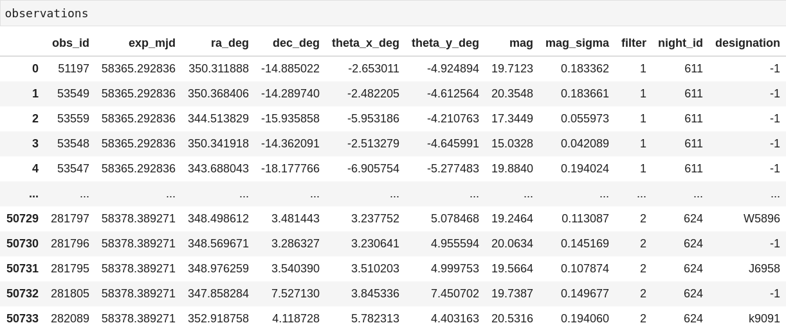

- 2) a DataFrame describing the linkages that were found in the observations by the external software. This DataFrame needs just two columns, one with the linkage ID and the other with the observation IDs that form that linkage  

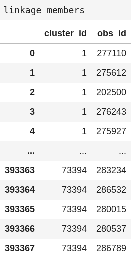

### What Can I Find?
In most cases the user can determine what known truths in their observations dataframe can be found by their respective linking algorithm. `difi` has two simple findability metrics:

The 'min_obs' metric: any object with this many or more observations is considered findable.  


The 'nightly_linkages' metric: any object with this many or more observations is considered findable.  
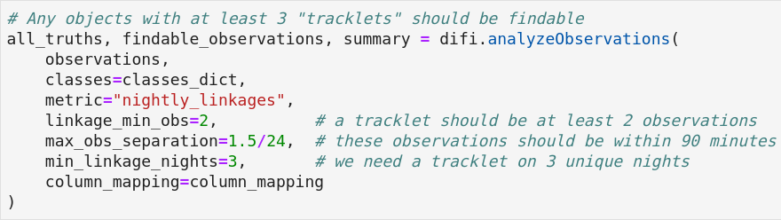

Which objects are findable?  
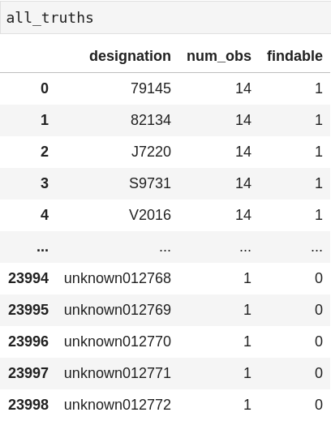

What observations made each object findable?  
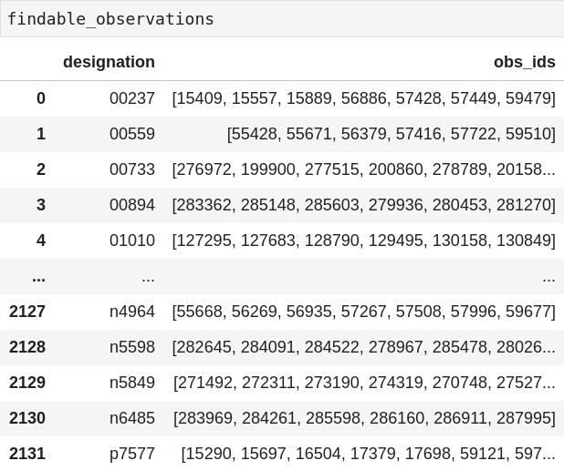

A summary of what kinds of objects are findable might be useful.  
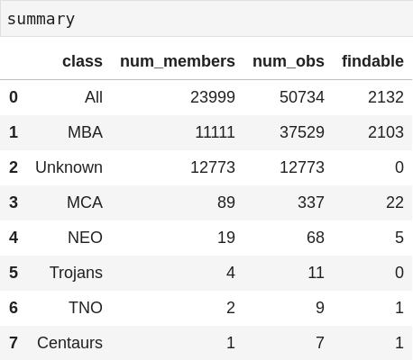

### Did I Find It?
Now lets see what the external linking software did find.

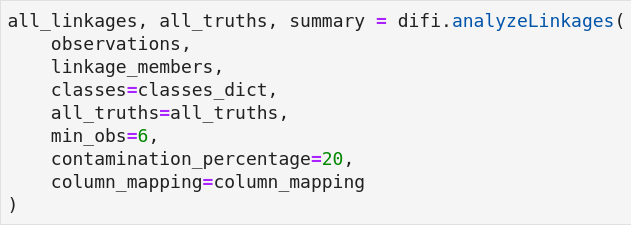

`difi` assumes there to be three different types of linkages:
- 'pure': all observations in a linkage belong to a unique truth
- 'partial': up to a certain percentage of non-unique thruths are allowed so long as one truth has at least the minimum required number of unique observations
- 'mixed': a linkage containing different observations belonging to different truths, we avoid using the word 'false' for these linkages as they may contain unknown truths depending on the use case. We leave interpretation up to the user.

Thanks to the power of `pandas` it can be super easy to isolate the different linkage types and analyze them separately.
Selecting 'pure' linkages:

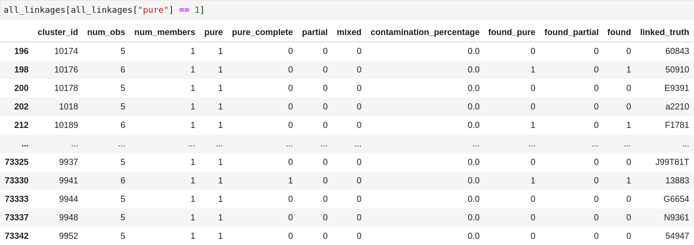

Selecting 'partial' linkages:

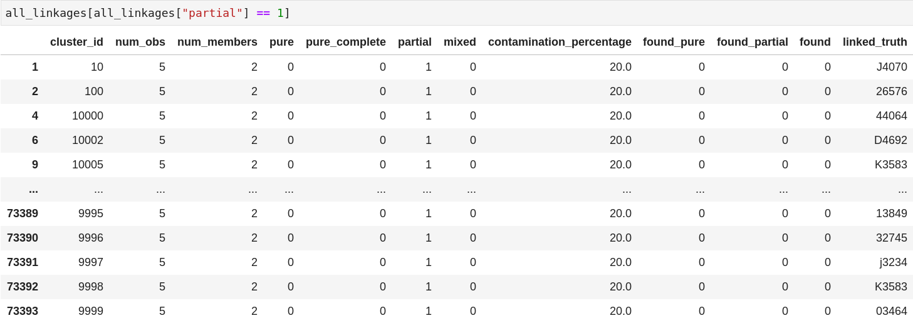

Selecting 'mixed' linkages:

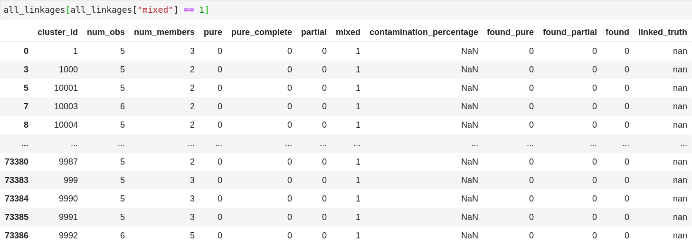


Understanding the specifics behind each linkage is one thing, but how did the linking algorithm perform on an object by object basis.
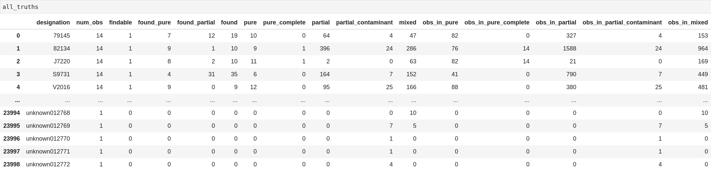

### Tutorial
A detailed tutorial on `difi` functionality can be found [here](https://github.com/moeyensj/difi/tree/main/examples).
