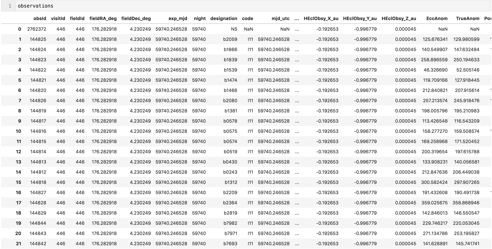
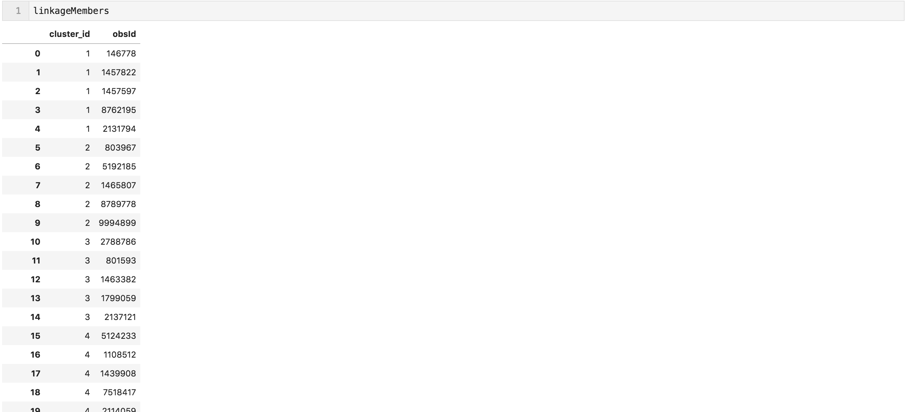
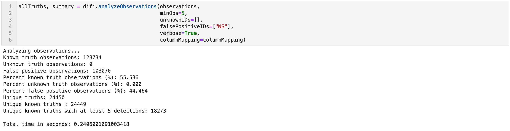
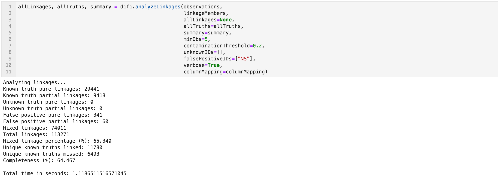
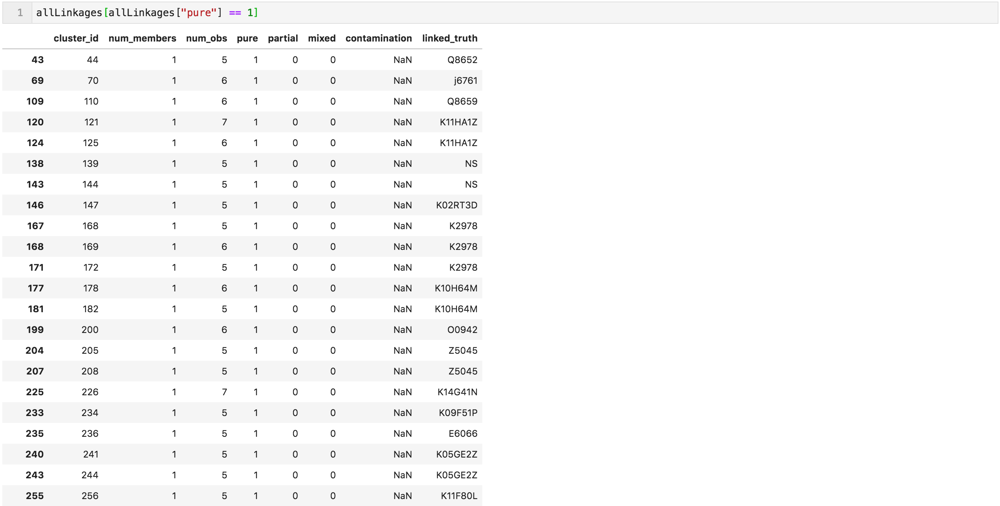
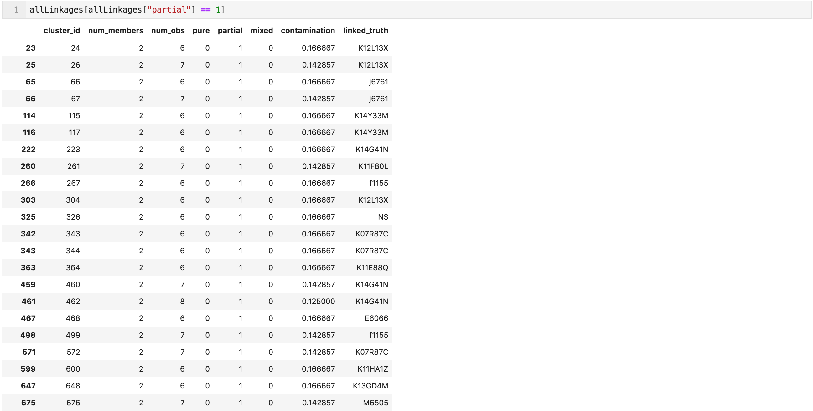
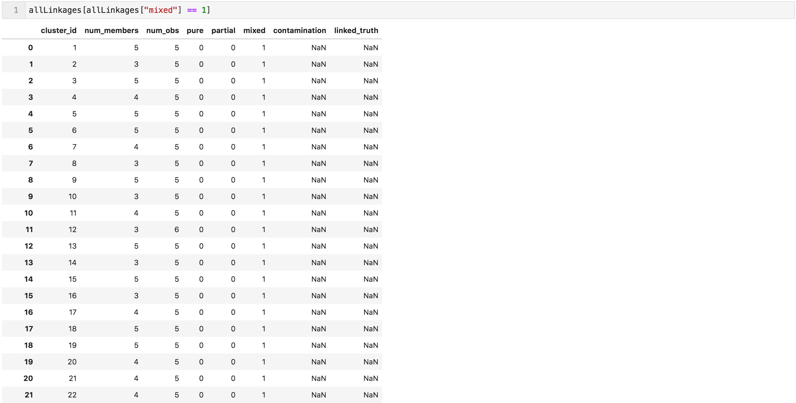
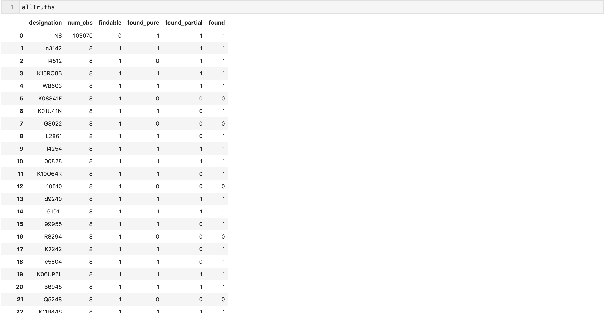

# difi
Did I Find It?  
[](https://dev.azure.com/moeyensj/difi/_build/latest?definitionId=1&branchName=master)
[](https://travis-ci.com/moeyensj/difi)
[](https://coveralls.io/github/moeyensj/difi?branch=master)
[](https://hub.docker.com/r/moeyensj/difi)  
[](https://img.shields.io/badge/Python-3.6%2B-blue)
[](https://opensource.org/licenses/BSD-3-Clause)

## About
`difi` is a simple package that takes pre-formatted linkage information from software such as [MOPS](https://github.com/lsst/mops_daymops), [pytrax](https://github.com/pytrax/pytrax) or [difi](https://github.com/moeyensj/difi) and analyzes which objects have been found. A key performance criteria is that `difi` needs to be fast by avoiding Python for loops and instead uses clever `pandas.DataFrame` manipulation. 

## Installation

We recommend installing the code along one of two installation paths: either a source code installation, or an installation via docker. 

### Source
Clone this repository using either `ssh` or `https`. Once cloned and downloaded, `cd` into the repository. 

To install difi in its own `conda` enviroment please do the following:  

```conda create -n difi_py36 -c defaults -c conda-forge -c astropy --file requirements.txt python=3.6```  

Or, to install difi in a pre-existing `conda` environment called `env`:  

```conda activate env```  
```conda install -c defaults -c conda-forge -c astropy --file requirements.txt```  

Or, to install pre-requisite software using `pip`:  

```pip install -r requirements.txt```

Once pre-requisites have been installed using either one of the tree options above, then:  

```python setup.py install```

You should now be able to start Python and import difi. 

### Docker

A Docker container with the latest version of the code can be pulled using:  

```docker pull moeyensj/difi:latest```

To run the container:  

```docker run -it moeyensj/difi:latest```

The difi code is installed the /projects directory, and is by default also installed in the container's Python installation. 

## Example

The example below can be found in greater detail in this [Jupyter Notebook](https://github.com/moeyensj/difi/tree/master/examples/example_thor.ipynb).

### Assumed Inputs
`difi` is designed to analyze a set of linkages made by external software where some of the underlying true linkages are known. It needs just two DataFrames of data:
- 1) a DataFrame containing observations, with a column for observation ID and a column for the underlying truth (don't worry! -- `difi` can handle false positives and unknown truths as well)  



- 2) a DataFrame describing the linkages that were found in the observations by the external software. This DataFrame needs just two columns, one with the linkage ID and the other with the observation IDs that form that linkage  



### What Can I Find? 
In most cases the user can determine what known truths in their observations DataFrame can be found by their respective linking algorithm. `difi` has its own simple findability metric which can be used if all you care about is that any known truths with a minimum number of observations should be found. 


### Did I Find It? 
Now lets see what the external linking software did find. 


`difi` assumes there to be three different types of linkages:
- 'pure': all observations in a linkage belong to a unique truth
- 'partial': up to a certain percentage of non-unique thruths are allowed so long as one truth has at least the minimum required number of unique observations
- 'mixed': a linkage containing different observations belonging to different truths, we avoid using the word 'false' for these linkages as they may contain unknown truths depending on the use case. We leave interpretation up to the user. 

Thanks to the power of `pandas` it can be super easy to isolate the different linkage types and analyze them separately.
Selecting 'pure' linkages:

Selecting 'partial' linkages:

Selecting 'mixed' linkages:


Understanding the specifics behind each linkage is one thing, but how did the linking algorithm perform on an object by object basis. 


### Other examples
More examples can be found [here](https://github.com/moeyensj/difi/tree/master/examples).
